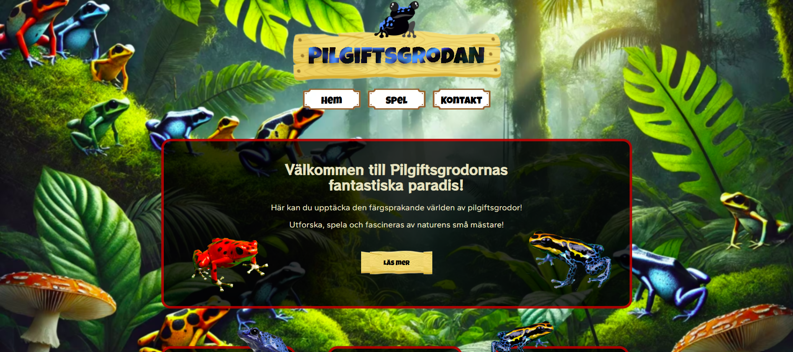
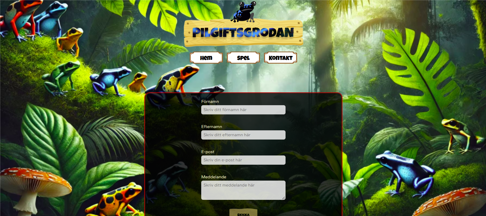
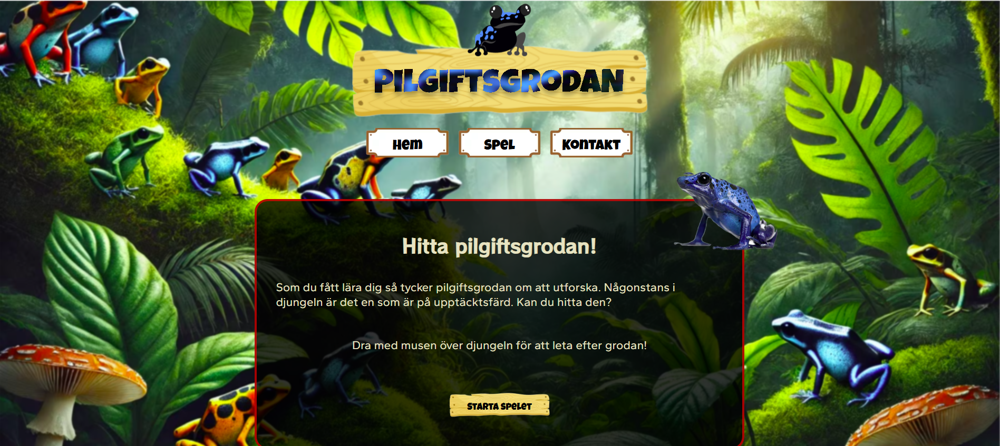
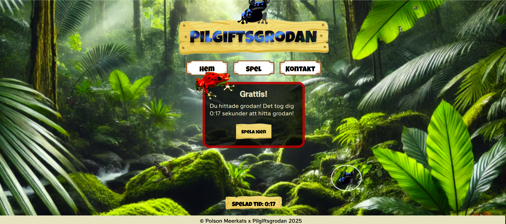
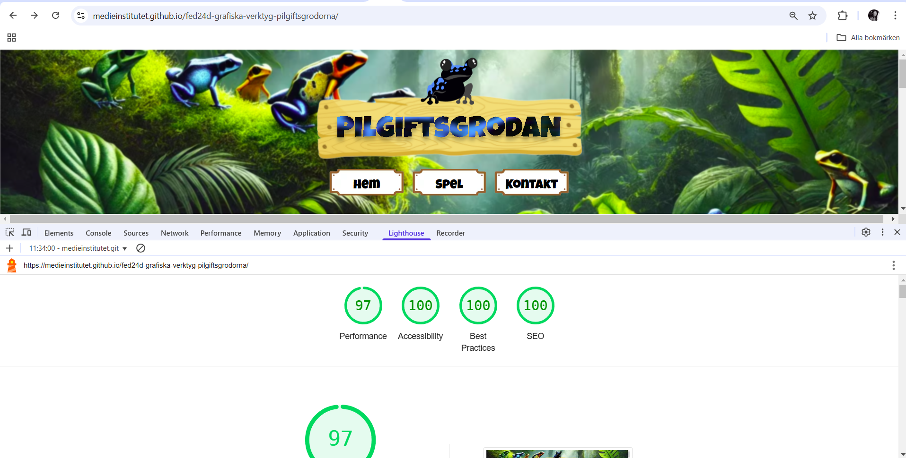

# 🐸 Welcome to the World of Poison Dart Frogs 
Welcome to our website about poison dart frogs! Here, you’ll get a glimpse into the colorful world of these small yet fascinating creatures. The site features both fun and interactive elements, such as a game where you can search for a hidden frog in the rainforest, as well as fun facts about poison dart frogs. Explore and learn more about these incredible animals in a fun and engaging way!


## 🔍 Project overview
This project is part of a school assignment where we developed a website about poison dart frogs based on a design created by another group (The Poison Dart Frogs). The purpose of the project was to practice component-based development in Vue.js while collaborating both within our own team and with another group. We gained experience in both designing and implementing a design created by others into a functional website.
The design was created in Figma by The Poison Dart Frogs, and we followed their guidelines for colors, typography, and layout during implementation.

This website is our first project using Vue.js and includes:
-	A landing section with information about poison dart frogs  
-	A contact page with a form  
-	An interactive game where players search for a hidden frog in the rainforest  

This project allowed us to explore Vue.js, Vue Router, and component-based development in practice. It was also a valuable learning experience to work from an existing design and translate it into code.


### 📖 The Story Behind the Name
As mentioned, the Poison Dart Frogs team ([Angelica Nylander](https://github.com/angien90), [Vy Petersson](https://github.com/tgvie), [Marie Lenvik](https://github.com/M-Lenvik) och [David Brunni](https://github.com/DavidBrunni)) created the design in Figma. Then, we – the Meerkats – took over both the design and the repo to bring it to life through code.
But when we inherited the Poison Dart Frogs’ repo, an identity crisis hit us—who were we now? That’s when the Meerkats transformed and became… The Poison Meerkats! 🎇 


## 🎥 Demo 
[Click here to view the demo] (https://medieinstitutet.github.io/fed24d-grafiska-verktyg-pilgiftsgrodorna/)


## 📸 Screenshots 
**Start page - Desktop**

**Contact page - Desktop**

**Game Lobby page - Desktop**

**Game page - Desktop**



## 🧑‍💻 Tech Stack 


 


### Tools:  


## ⚙️ Installation
To get started with the project, you need to have pnpm installed on your computer. Then follow these steps:

1. **Clone the repository:**  
Open your terminal and run the following command to clone the project:

```bash
git clone https://medieinstitutet.github.io/fed24d-grafiska-verktyg-pilgiftsgrodorna.git
```

Then, navigate into the project directory: 
```bash
cd fed24d-grafiska-verktyg-pilgiftsgrodorna
```

2. **Install project dependencies:**  
Run the following command to install all necessary dependencies:

```bash
pnpm install
```

3. **Start the development server:**
To launch the project locally, run:

```bash
pnpm dev
```

4. **Preview the project:**
If you want to preview the project in a production-like environment without building it for production, you can use the following command:

```bash
pnpm preview
```

5. **Build the project for production:**
When you're ready and want to build the project for production:

```bash
pnpm build
```


## 📌 Our Work Process
-	**Planning & Task Distribution** – Issues were created in GitHub.
-	**Component Development** – We followed a mobile-first approach and used Vue components.
-	**Pair Programming & Code Review** – Some parts were developed through pair programming. Each team member submitted at least two PRs, and every PR was reviewed by at least two team members before being merged.
-	**Merging & Collaboration** – Merges from the develop branch to main were done together as a team to ensure quality and consistency.
-	**Testing & Deployment** – The website was tested on various devices before launch.

## 🚦 Lighthouse analysis 

**Lighthouse report**



## ✍️ Authors 
Created by: 
- [Olivia Almseger ](https://github.com/oliviaalmseger) 	
- [Moa Magnfors ](https://github.com/mainforce) 
- [Nicole Sjöberg-Silfverling](https://github.com/nicolesilfverling) 
- [Alice Swahn](https://github.com/aliceswahn) 
- [Agnes Wilson](https://github.com/agneswilson) 


## 🤝 Credits
This project was developed as part of the curriculum at [Medieinstitutet](https://medieinstitutet.se/) during our first year of studies.
